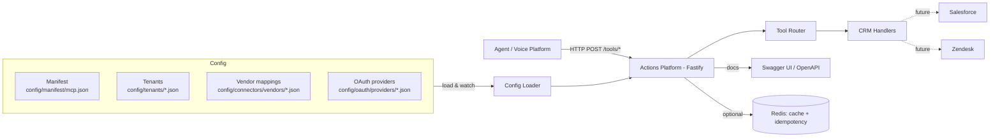
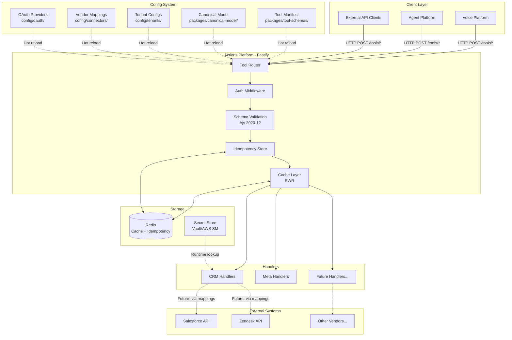
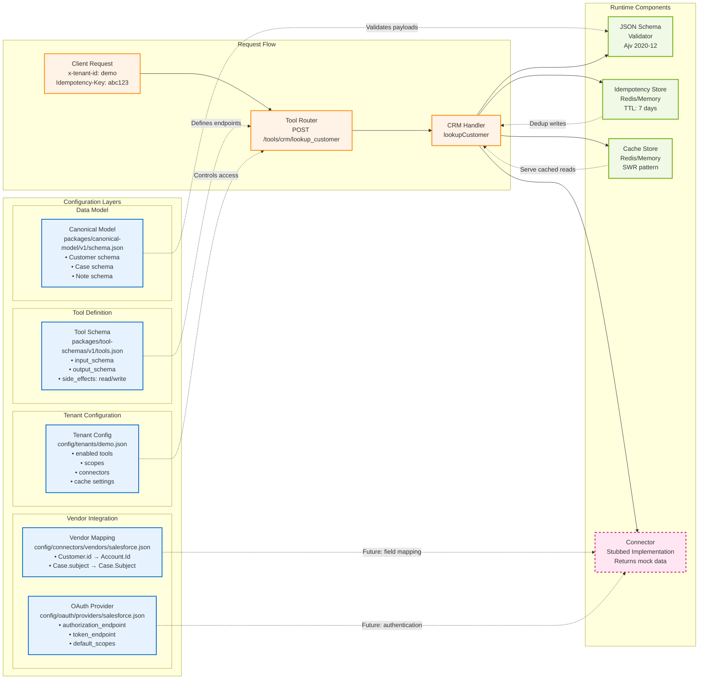

# Ecco Backline — Actions Platform

Schema-first, config-driven API platform for customer support integrations. Brokers between canonical data models and vendor-specific connectors (Salesforce, Zendesk, etc.).

> **Reference Architecture**  
> This codebase demonstrates patterns for client integration layers: config-driven tools, JSON Schema validation, idempotent writes, tenant isolation, and observability hooks.

### Architecture at a glance



**Key Features:** Declarative tools • OpenAPI + Swagger UI • JSON Schema validation • Canonical data model • Idempotent writes • Optional Redis caching

## Status

**✅ Implemented:** Core API, schema validation, idempotency, multi-tenant config, OpenAPI docs, Redis caching  
**🚧 Stubbed:** Vendor connectors, observability hooks, rate limiting, circuit breaker, automated tests

## Architecture Diagrams

### System Architecture & Request Flow



### Configuration-Driven Data Flow



**Requirements:** Node.js >= 20.10, optional Redis 6+

## Quick Start

```bash
git clone <this-repo> && cd ecco-backline && npm install
npm run dev  # starts on http://localhost:3030
```

**API Docs:** http://localhost:3030/docs  
**Health:** http://localhost:3030/health

### Development Templates

- **`env.example`** - Environment configuration template
- **`Dockerfile.example`** - Production build pattern  
- **`docker-compose.example.yml`** - Local setup with Redis
- **`CONTRIBUTING.md`** - Patterns for extending tools and connectors

## Configuration

**Main manifest:** `config/manifest/mcp.json` (hot-reloaded)  
**Tenants:** `config/tenants/*.json` (enabled tools, connectors, cache settings)  
**Vendor mappings:** `config/connectors/vendors/*.json` (canonical ↔ provider field mapping)  
**OAuth providers:** `config/oauth/providers/*.json` (endpoint metadata)

## API

**Routes:** `/tools/<tool.name>` (dots → slashes)  
**Multi-tenant:** `x-tenant-id` header (defaults to `demo`)  
**Idempotency:** `Idempotency-Key` header required for writes  
**Auth:** Declared in OpenAPI but not enforced (add gateway/plugin as needed)

### Example Usage

```bash
# Health check
curl -s http://localhost:3030/tools/meta/health | jq

# Customer lookup (read)
curl -s -H 'Content-Type: application/json' -H 'x-tenant-id: demo' \
  -X POST http://localhost:3030/tools/crm/lookup_customer \
  -d '{"query":"user@example.com"}' | jq

# Create case (write - requires Idempotency-Key)
curl -s -H 'Content-Type: application/json' -H 'x-tenant-id: demo' \
  -H 'Idempotency-Key: case-123' \
  -X POST http://localhost:3030/tools/crm/create_case \
  -d '{"customer_id":"cust_abc","subject":"Issue with order"}' | jq
```

## Architecture Details

**Caching:** SWR pattern with Redis (optional fallback to memory)  
**Idempotency:** 7-day deduplication for writes, scoped by tenant+tool  
**Observability:** Config hooks for tracing/metrics (not yet wired up)  
**Environment:** `PORT`, `LOG_LEVEL`, `REDIS_URL` (see `env.example`)

**Development:** `npm run dev` • `npm run build` • `npm run typecheck`

## Extending

See **`CONTRIBUTING.md`** for detailed patterns:
- Adding new tools (schema → handler → tenant config)
- Adding new connectors (mapping → OAuth → client)
- Configuration-driven architecture principles

## Why Reference Architecture?

**Schema-first:** JSON Schema validation for all inputs/outputs  
**Config-driven:** Tools, tenants, connectors declared in JSON  
**Extensible:** Add new integrations without modifying core runtime  
**Multi-tenant:** Isolation via config, rate limiting, circuit breakers  
**Enterprise-ready:** Idempotency, observability hooks, audit trail

## License

License to be determined.


