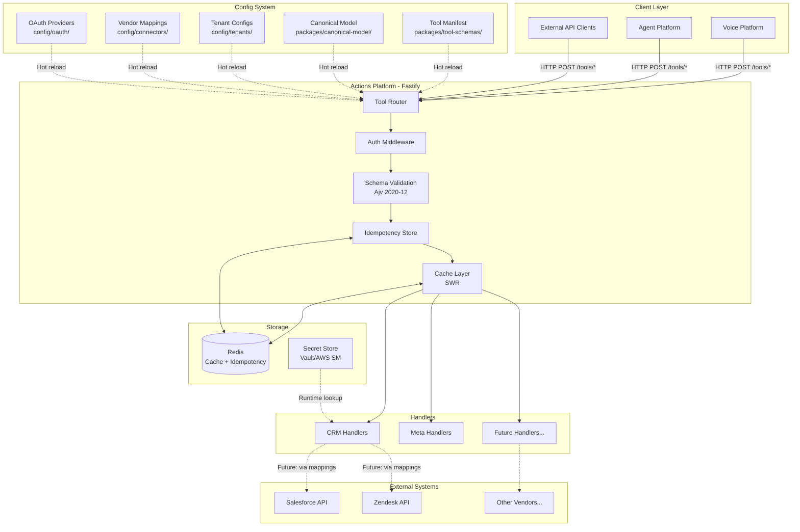
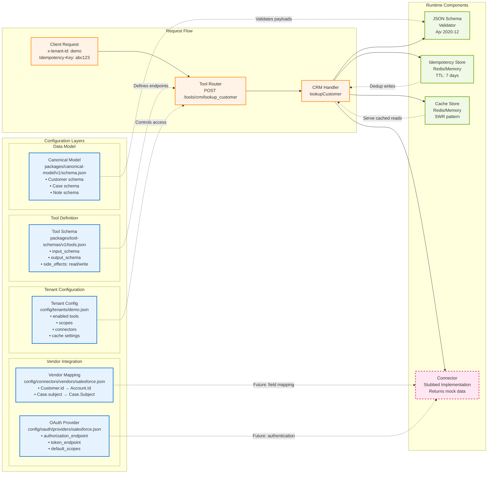

## Ecco Backline — Actions Platform

The Ecco Backline service is the integration backbone for our voice and agent platform.
It exposes a schema-first, config-driven API layer that brokers between canonical models and vendor-specific connectors (e.g., Salesforce, Zendesk).

> Reference architecture
> This codebase is intended to serve as a reference architecture for future client integration layers.
> The patterns here (config-driven tools, JSON Schema validation, idempotent writes, tenant isolation, and observability hooks) are designed to be reused and extended across client projects.

### Architecture at a glance

```mermaid
flowchart LR
  Client[Agent / Voice Platform] -->|HTTP POST /tools/*| AP[Actions Platform (Fastify)]
  subgraph Config
    M[Manifest\nconfig/manifest/mcp.json]
    T[Tenants\nconfig/tenants/*.json]
    V[Vendor mappings\nconfig/connectors/vendors/*.json]
    O[OAuth providers\nconfig/oauth/providers/*.json]
  end
  Config -->|load & watch| CL[Config Loader]
  CL --> AP
  AP --> TR[Tool Router]
  TR --> HCRM[CRM Handlers]
  HCRM -->|future| SF[Salesforce]
  HCRM -->|future| ZD[Zendesk]
  AP -->|docs| Swagger[Swagger UI / OpenAPI]
  AP -->|optional| Redis[(Redis: cache + idempotency)]
```

### Highlights
- **Declarative tools**: Tools are defined in `packages/tool-schemas/v1/tools.json` and auto-exposed as HTTP routes.
- **OpenAPI + Swagger UI**: Interactive docs at `/docs`, raw spec at `/openapi.json`.
- **JSON Schema validation**: Ajv 2020-12 validates both requests and responses.
- **Canonical data model**: Shared schema in `packages/canonical-model/v1/schema.json` keeps payloads consistent across vendors.
- **Idempotent writes**: Built-in deduplication for write operations via `Idempotency-Key`.
- **Optional Redis**: Caching (SWR) for reads and persistence for idempotency.

## Project Status

This codebase is production-ready at the architectural level, with several features intentionally stubbed for future work:

- ✅ Core Fastify API with JSON Schema validation, idempotency, and multi-tenant config loading
- ✅ Config-driven tool manifest with auto-generated endpoints and OpenAPI docs
- ✅ Optional Redis caching and idempotency persistence
- 🚧 Vendor connectors (Salesforce, Zendesk) are not implemented yet; handlers return stub data
- 🚧 `crm.list_cases` endpoint is declared but not implemented (returns 501)
- 🚧 Observability hooks (tracing, metrics, audit sink) exist in config but are not wired up in code
- 🚧 Automated test suite not yet in place
- 🚧 Rate limiting and circuit breaker are defined in config but not yet implemented in runtime

## Architecture Diagrams

### System Architecture & Request Flow



### Configuration-Driven Data Flow



## Project layout

- `apps/actions-platform`: Fastify server that loads configuration, registers tools, and serves the API
  - `src/index.ts`: App entry; sets up Fastify, Ajv, Swagger, and routes
  - `src/lib/toolRouter.ts`: Dynamically registers routes for tools from the manifest
  - `src/lib/handlers/crm.ts`: Example CRM handlers (lookup, create case, add note)
  - `src/lib/configLoader.ts`: Loads and watches config bundle (manifest, schemas, canonical model)
  - `src/lib/idempotency.ts`: Stable stringify + SHA-256 hashing + Redis/memory store
  - `src/lib/redisClient.ts`: Lazy Redis client init (uses `REDIS_URL`)
- `packages/canonical-model/v1/schema.json`: Canonical JSON Schema for domain objects (Customer, Case, Note, etc.)
- `packages/tool-schemas/v1/tools.json`: Tool definitions (name, description, input/output schemas, side-effects)
- `config/manifest/mcp.json`: Top-level manifest that references the tool manifest, canonical model, and schema files
- `config/schemas/*.schema.json`: JSON Schemas for config files (tenants, OAuth providers, vendor mappings, tool manifest)
- `config/tenants/*.json`: Per-tenant configuration (enabled tools, connectors, caching, audit, observability)
- `config/connectors/vendors/*.json`: Vendor mapping files to translate canonical fields to provider-native fields
- `config/oauth/providers/*.json`: OAuth provider metadata and defaults

## Requirements

- Node.js >= 20.10
- Optional: Redis 6+ (for caching and idempotency persistence)

## Running

### Development

```bash
node -v        # must be >= v20.10
git clone <this-repo>
cd ecco-backline
npm install

# Optional: start Redis locally
# docker run --rm -p 6379:6379 redis:7

# Start the server with hot-reload (tsx)
npm run dev
# Or start with Redis enabled
# REDIS_URL=redis://localhost:6379 npm run dev
```

Verify it's running:

```bash
curl -s http://localhost:3030/health | jq
# then open http://localhost:3030/docs
```

### Production

```bash
npm run build
node apps/actions-platform/dist/index.js
# Optional env vars:
# PORT=3030 LOG_LEVEL=info REDIS_URL=redis://localhost:6379 node apps/actions-platform/dist/index.js
```

### Docker (example)

Example Dockerfile (adjust as needed for your CI/CD):

```dockerfile
FROM node:20-alpine AS build
WORKDIR /app
COPY package*.json tsconfig.base.json ./
COPY apps ./apps
COPY packages ./packages
COPY config ./config
RUN npm ci && npm run build

FROM node:20-alpine
WORKDIR /app
ENV NODE_ENV=production PORT=3030
COPY --from=build /app .
EXPOSE 3030
CMD ["node", "apps/actions-platform/dist/index.js"]
```

Build and run:

```bash
docker build -t ecco-backline .
docker run -p 8080:3030 ecco-backline
```

## API documentation

- Swagger UI: http://localhost:3030/docs
- OpenAPI JSON: http://localhost:3030/openapi.json
- Health: http://localhost:3030/health

## Configuration model

The server loads a bundled configuration from `config/manifest/mcp.json` (hot-reloaded when `watch: true`). That manifest points to:

- `packages/tool-schemas/v1/tools.json`: tool list and schemas
- `packages/canonical-model/v1/schema.json`: canonical model (registered with both Fastify and Ajv)
- `config/schemas/*.schema.json`: schemas to validate config files

### Tenants

Per-tenant config in `config/tenants/*.json` controls:
- **Enabled tools** and per-tool **scopes** (`tools.enabled`, `tools.scopes`)
- **Connectors** (provider, auth, timeouts, rate limits, mapping file)
- **Cache** knobs (e.g., `customer_lookup_ttl_ms`, `stale_while_revalidate_ms`)
- **Audit**, **observability**, and **idempotency** settings

See `config/tenants/demo.json` for a complete example wired to `salesforce` and `zendesk` mappings and OAuth providers.

### Connectors and vendor mappings

Vendor mapping files in `config/connectors/vendors/*.json` describe how canonical fields map to provider-native structures. Example files:
- `config/connectors/vendors/salesforce.json`
- `config/connectors/vendors/zendesk.json`

Note: The current handlers in `src/lib/handlers/crm.ts` are stubbed; the vendor calls are not yet implemented and will use these mappings in a later iteration.

### OAuth providers

Provider metadata in `config/oauth/providers/*.json` documents endpoints, supported grants, and default scopes used by connectors.

## API

### Authentication

The OpenAPI spec declares `bearerAuth` and `mtls` security schemes and sets `bearerAuth` as default. The demo server does not enforce auth itself; run it behind an API gateway or add an auth plugin as needed.

### Multi-tenancy

- Provide `x-tenant-id` header to select a tenant (defaults to `demo`).

### Route conventions

- Tools are exposed under `/tools/<tool.name>` with dots replaced by slashes.
  - Example: `crm.lookup_customer` → `POST /tools/crm/lookup_customer`

### Idempotency for writes

- Required for tools with `side_effects: "write"`.
- Provide the `Idempotency-Key` header or include `idempotency_key` in the request body.
- Identical requests with the same key will return the same response for up to 7 days.

### Endpoints (examples)

#### Health

```bash
curl -s http://localhost:3030/tools/meta/health | jq
```

#### Lookup customer (read)

```bash
curl -s \
  -H 'Content-Type: application/json' \
  -H 'x-tenant-id: demo' \
  -X POST http://localhost:3030/tools/crm/lookup_customer \
  -d '{"query":"user@example.com"}' | jq
```

Sample response (stubbed):

```json
{
  "match_quality": "strong",
  "customer": {
    "id": "cust_…",
    "identifiers": { "email": "user@example.com" },
    "primary_contact": { "name": "Unknown", "phones": [], "emails": [] },
    "external_ids": [],
    "attributes": {},
    "entitlements": [],
    "segments": []
  }
}
```

#### Create case (write)

```bash
curl -s \
  -H 'Content-Type: application/json' \
  -H 'x-tenant-id: demo' \
  -H 'Idempotency-Key: create-case-123' \
  -X POST http://localhost:3030/tools/crm/create_case \
  -d '{
    "customer_id": "cust_abc",
    "subject": "Issue with order",
    "priority": "normal",
    "tags": ["voice", "returns"]
  }' | jq
```

#### Add note (write)

```bash
curl -s \
  -H 'Content-Type: application/json' \
  -H 'x-tenant-id: demo' \
  -H 'Idempotency-Key: note-001' \
  -X POST http://localhost:3030/tools/crm/add_note \
  -d '{
    "case_id": "case_abc",
    "body": "Spoke with customer; awaiting RMA.",
    "visibility": "internal",
    "author": "agent"
  }' | jq
```

Note: `crm.list_cases` exists in the schema but is not implemented yet; calls will return `501 Not Implemented` until handlers are added.

## Testing

Recommended next steps:

- Unit tests for idempotency, caching behavior, and request validation
- Integration tests for tool endpoints using Fastify's inject()
- Contract tests against JSON Schemas for inputs/outputs

## Observability

Tenant configs support `observability.tracing` and `observability.metrics`, but no OpenTelemetry instrumentation is currently wired up.
To enable full observability, integrate the OTel Node SDK or Fastify plugins to emit spans/metrics.

Audit sinks are declared in config; a background job should export logs to the configured sink.

## Caching and idempotency

- **Caching (SWR)**: `crm.lookup_customer` uses Redis (if configured) to serve cached results quickly and revalidate in the background. TTLs are controlled per-tenant (`config/tenants/*.json`).
- **Idempotency store**: Deduplicates write requests. Uses Redis if available; otherwise falls back to an in-memory store with the same TTL. Keys are scoped by tenant and tool.

## Environment variables

- `PORT`: Server port (default: `3030`)
- `LOG_LEVEL`: Pino log level (default: `info`)
- `REDIS_URL`: e.g., `redis://localhost:6379` enables Redis for caching/idempotency

## Development

```bash
# Type-check
npm run typecheck

# Build (emits to dist/ for each workspace)
npm run build

# Clean build outputs
npm run clean
```

Code style:
- TypeScript (ESM) targeting Node 20+
- Prefer explicit, validated contracts via JSON Schema

## Extending the platform

1) Define a new tool in `packages/tool-schemas/v1/tools.json`:
- Add an entry with `name`, `description`, `input_schema`, `output_schema`, and `side_effects`.

2) Implement the handler in the server:
- For simple prototypes, extend `src/lib/handlers/crm.ts` or add a new handler module.
- Register it in `src/lib/toolRouter.ts` by branching on `tool.name` or by introducing a dispatch map.

3) Wire up connector logic (optional):
- Use `config/connectors/vendors/*.json` mappings to translate to/from provider APIs.
- Implement provider clients (e.g., with `undici`) and apply mappings.

4) Update tenant config:
- Enable the tool in `config/tenants/<tenant>.json` and assign required scopes.

## Next steps for new team

1. Implement vendor connectors (Salesforce, Zendesk) and wire into CRM handlers
2. Flesh out missing tool (`crm.list_cases`)
3. Add OpenTelemetry tracing/metrics using the existing config hooks
4. Build test suite (unit + integration)
5. Add background job to ship audit logs from the configured sink

## Roadmap and limitations

- Vendor connectors are not yet implemented; handlers currently return stubbed data.
- `crm.list_cases` route is defined in the schema but not yet wired up.
- Authentication/authorization is declared in OpenAPI but not enforced by the demo server.
- No persistence layer is configured beyond optional Redis.

## Why reference architecture?

This repository is designed as a blueprint for future client integration layers:

- Schema-first: JSON Schema validation for all inputs/outputs
- Config-driven: Tools, tenants, and connectors declared in JSON
- Extensible: Add new connectors or tools without modifying core runtime
- Multi-tenant: Isolation via config; groundwork for rate limiting and circuit breakers
- Enterprise-ready: Idempotency, observability hooks, and audit trail baked in

## License

License to be determined.


